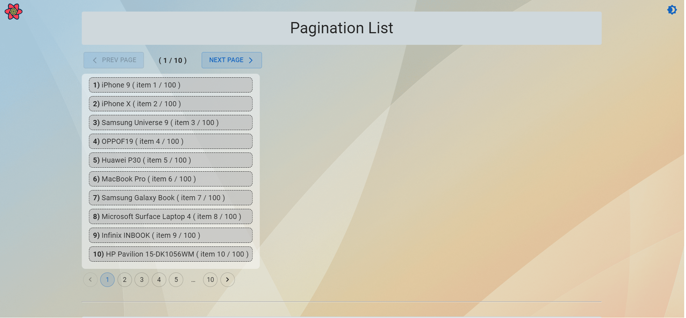

# pagination-infinite-scroll

<h3>Hello guys</h3>

This is a pagination and infinite scroll list with some features

I appreciate it if you contribute to this project and add other options and more themes or colors to this list. Thanx!

### * Languages and Tools:

  

  
  
   

  

  

  

  

  
 
  
  
        

### * Screenshot:

